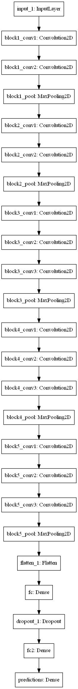

- [Behavior Cloning Project](#)
	- [Model Architecture](#)
		- [Architecture Characteristics](#)
	- [Dataset generation](#)
		- [Dataset images example](#)
		- [Image Preprocessing](#)
	- [Training](#)
	- [Simulation](#)
		- [Simulation instructions](#)


#Behavior Cloning Project

This project describes a Keras Deep neural network built for vehicle lane
tracking using camera images for the Udacity vehicle simulator.

Initially, an image dataset is generated using a usb steering wheel by driving
around the track.

Then a VGG16 network is used as a baseline to train the vehicle steering, with
dense layers added to the end


##Model Architecture
The deep neural network is defined based on VGG16. The great advantage of using
VGG16 is that there are plenty pre-computed weights for its convolutional layers,
available even directly from Keras:
  ```python
  from keras.applications.vgg16 import VGG16
  input_layer = Input(shape=inputshape)
  base_model = VGG16(weights='imagenet', include_top=False, input_tensor=input_layer)
  layer = base_model.output
  ...
  ```

In the code example, the weights from imagenet are loaded into the model.

The Final DNN is defined as in the Model:


###Architecture Characteristics

|Input                       |
|----------------------------|
|Conv 3x3x64 activation Relu |
|Conv 3x3x64 activation Relu |
|Max Pooling 2x2             |
|----------------------------|
|Conv 3x3x128 activation Relu|
|Conv 3x3x128 activation Relu|
|Max Pooling 2x2             |
|----------------------------|
|Conv 3x3x256 activation Relu|
|Conv 3x3x256 activation Relu|
|Conv 3x3x256 activation Relu|
|Max Pooling 2x2             |
|----------------------------|
|Conv 3x3x512 activation Relu|
|Conv 3x3x512 activation Relu|
|Conv 3x3x512 activation Relu|
|Max Pooling 2x2             |
|----------------------------|
|Conv 3x3x512 activation Relu|
|Conv 3x3x512 activation Relu|
|Conv 3x3x512 activation Relu|
|Max Pooling 2x2             |
|----------------------------|
|Flatten                     |
|Dense (1024) activation Relu|
|Dropout (0.5)               |
|Dense (2)  activation linear|
|Dense (1)  activation linear|
|----------------------------|

##Dataset generation


In order to keep the dataset symmetric , after three laps are recorded, the
collection was paused to reverse driving direction, and another three laps were
collected in the opposite direction.

In order to allow the car to not only drive in the center of the lane, but also
recover if it eventually comes out of this center, an extra data collection is
appended to the original 6-lap dataset with images of the vehicle only
recovering from the side of the lane to its center

The dataset is then processed to reduce the images size, which was originally
__360x160__, to __160x80__. The training is concerned only with the image portion that
covers the lane, therefore the image was cropped horizontally in the middle,
keeping the bottom part. The final image resolution therefore is __160x40__.

The dataset provided in the resources was used to complement the
generated.

###Dataset images example
|Left | Center | Right|
|-----|--------|------|
||||
||||

###Image Preprocessing
Besides cropping and resizing the images, before feeding in the neural network,
the image Luminosity histogram is equalized, and then the pixels are normalized
to be zero mean and unit standard deviation.

##Training

The network is trained alternating between Udacity's dataset and the personal
dataset. After both datasets are used, a second pass is done for the datasets,
but this time excluding inputs that have a small turning angle. This is done to
emphasize the desired behavior of correcting steering. In order to fine-tune the
weights, additional trainings were done over the dataset varying the angle
rejection value. Each training over the dataset is done with 3 epochs.

##Simulation

The trained network is put to use in the simulator with the drive.py file, that
is modified from the original to preprocess the camera input, and also to allow
sending some commands to the vehicle for debugging/test purposes.

The trained model was able to drive without errors in the trained track, and
with some reservations in the additional track. The possible issues for the
additional track are that there are some sharper turns in that track, that the
model was not able to capture in the dataset, limiting the angle at which the
vehicle responds.

As a point for improvement, the dataset should contain smoother recoveries for
training. As the recoveries were in general sharp, the vehicle tends to oscillate
when it starts veering to the lateral.

###Simulation instructions
In order to better evaluate the vehicle's performance, some changes were made to the __drive.py__ file. 
The car desired speed can be controlled with the following pattern:

* __w__: increase desired speed
* __s__: reduce desired speed
* __a__: force steer left with 12.5 degrees
* __d__: force steer right with 12.5 degrees
* __*spacebar*__: kill throttle

At any time, the command can be cancelled by pressing any other key.
**Remark**: In order for this commands to work, the terminal where drive.py is executed must be on focus.
